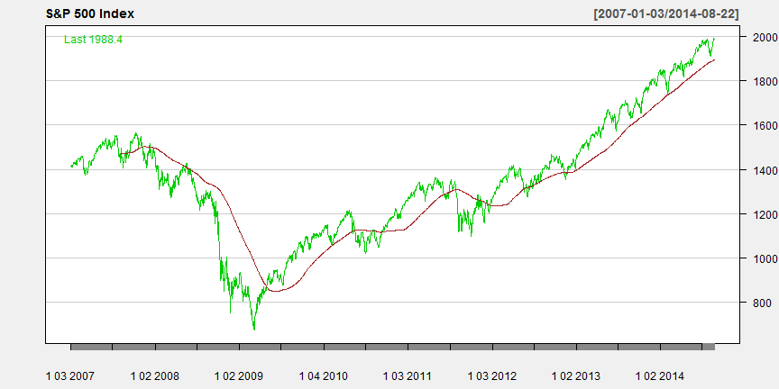

## S&P500 chart with 150 period SMA


```
## [1] "GSPC"
```



---

## Trading Strategy

* Price crosses the moving average
  - Signalise the reversal of the trend
  - Price will continue in the direction of the crossing 
* Price bounces of the moving average
 -  Means that price will continue to follow the current trend for some time
* Very often crossing turns out to be bounce of and vice versa
* To reduce risk, analysts often use several Moving Averages computed form different number of periods

---

## References

- S&P500 Index: http://en.wikipedia.org/wiki/S%26P_500
- Moving Average: http://www.investopedia.com/terms/m/movingaverage.asp
- Quantmod: http://www.quantmod.com/
